```{r setup, include=FALSE}
knitr::opts_chunk$set(
  echo = FALSE,
  warning = FALSE,
  message = FALSE,
  fig.align = "center",
  out.width = "92%"
)
```

```{r body-report, results='asis'}
report_lines <- readLines("FINAL_REPORT_DRAFT.md", encoding = "UTF-8")
if (length(report_lines) > 0 && startsWith(report_lines[1], "# ")) {
  report_lines <- report_lines[-1]
  if (length(report_lines) > 0 && report_lines[1] == "") {
    report_lines <- report_lines[-1]
  }
}
promote_heading <- function(line) {
  match <- regexpr("^#{2,6} ", line)
  if (match[1] == -1) {
    return(line)
  }
  sub("^#", "", line)
}
report_lines <- vapply(report_lines, promote_heading, character(1))
cat(report_lines, sep = "\n")
```

\newpage

# 그림 부록

```{r fig-dag-identification, fig.cap='DAG 기반 통제변수 선택 구조'}
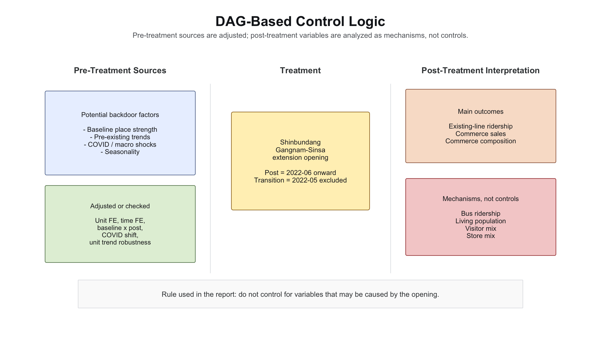
```

```{r fig-dag-robustness, fig.cap='DAG 기반 통제변수 robustness DID 추정치'}
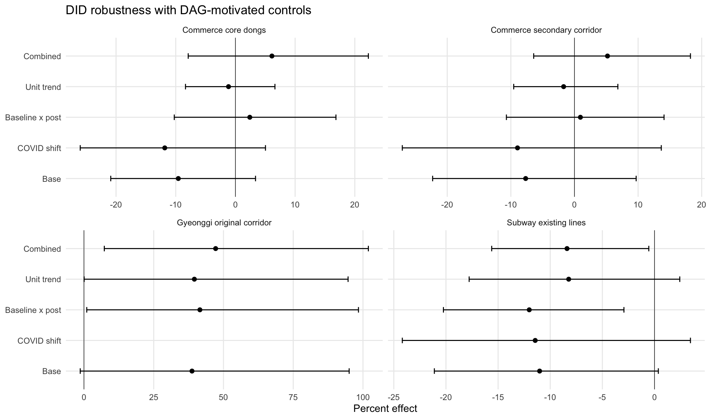
```

```{r fig-subway-trend, fig.cap='기존 환승·인접역과 통제역의 월별 평균 일일 승하차량 추세'}
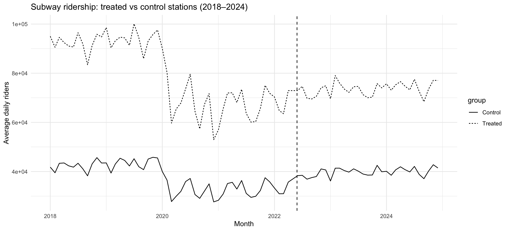
```

```{r fig-subway-event, fig.cap='지하철 event-study 추정치'}
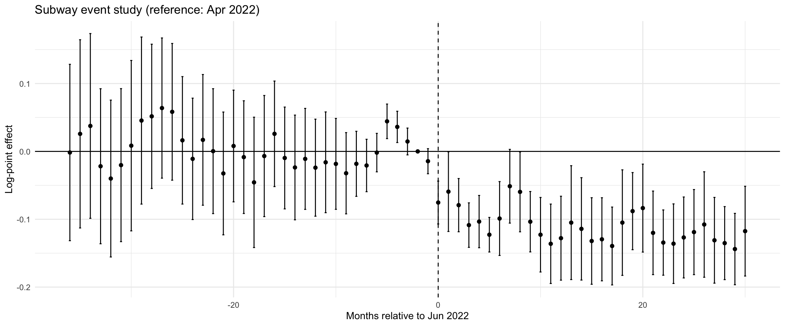
```

```{r fig-subway-scm, fig.cap='지하철 synthetic control 결과'}
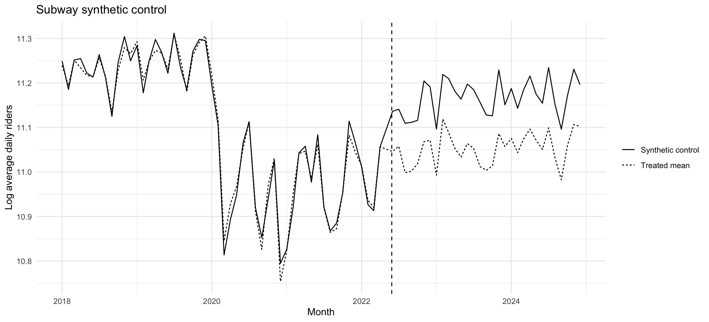
```

```{r fig-subway-direction, fig.cap='방향·시간대별 지하철 DID 추정치'}
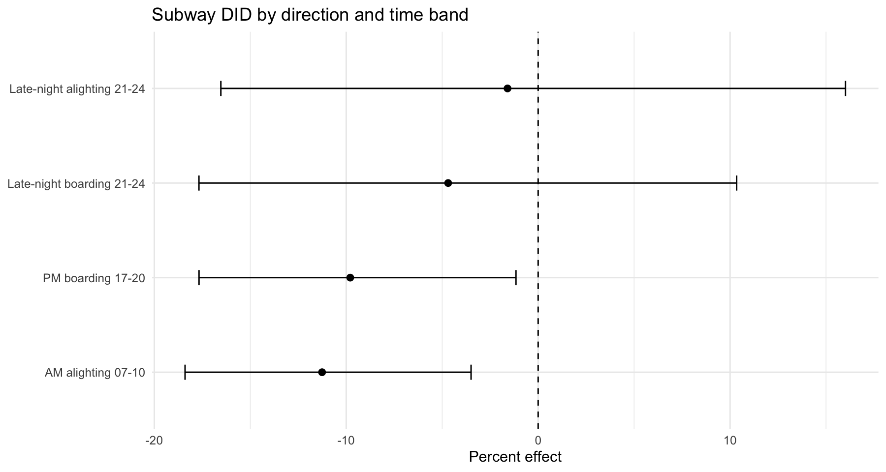
```

```{r fig-commerce-three-group, fig.cap='Anchor, secondary corridor, control 상권 매출 추세'}
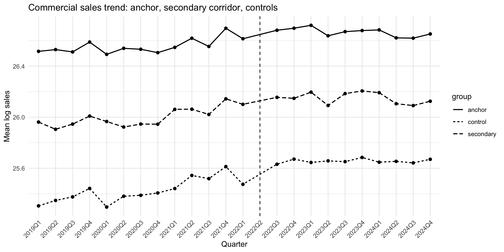
```

```{r fig-commerce-age, fig.cap='Secondary corridor 소비자 구성 DID 추정치'}
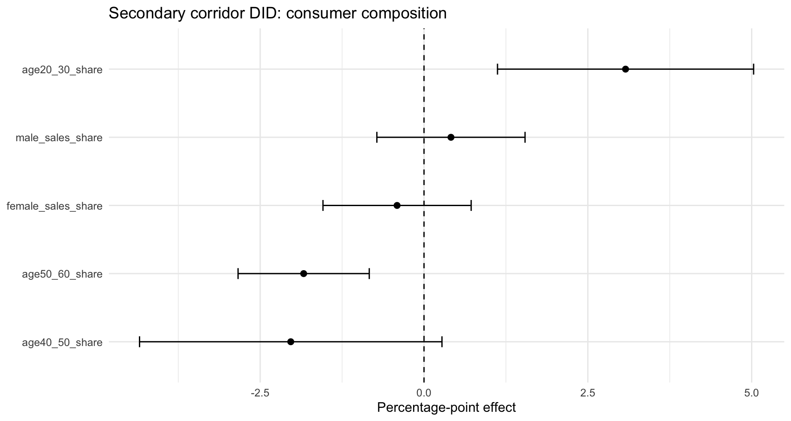
```

```{r fig-bus-corridor, fig.cap='신분당선 corridor 인근 버스 정류장 DID 추정치'}
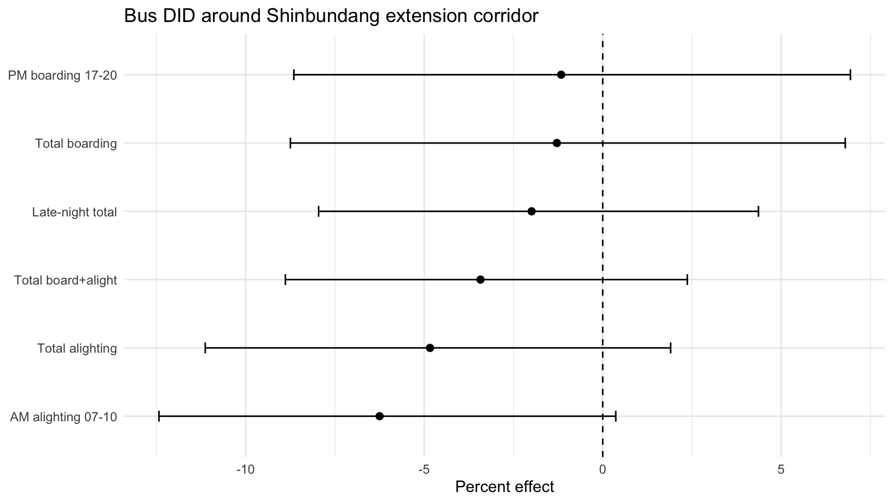
```

```{r fig-living-composition, fig.cap='Secondary corridor 생활인구 구성 DID 추정치'}
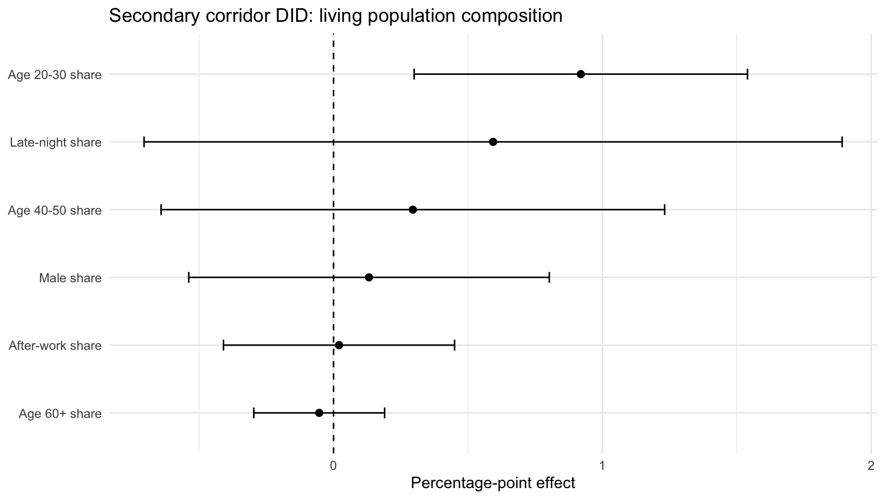
```

```{r fig-subway-daygroup, fig.cap='요일군별 지하철 DID 추정치'}
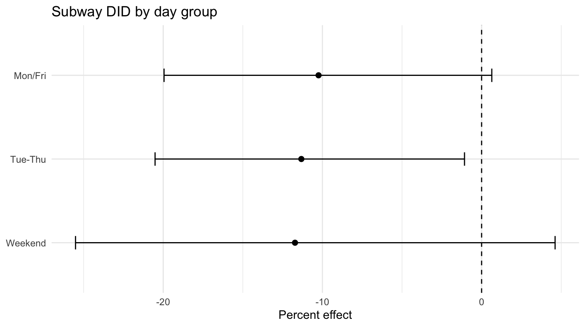
```

```{r fig-gyeonggi-trend, fig.cap='분당구 원 신분당선 corridor와 통제동의 활동인구 추세'}
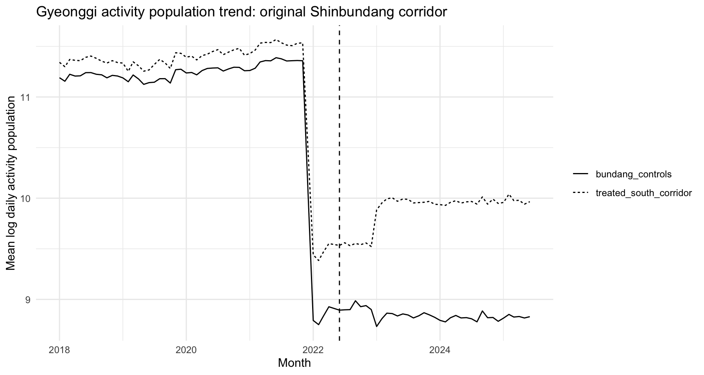
```

```{r fig-gyeonggi-did, fig.cap='경기도 API 활동인구 DID 추정치'}
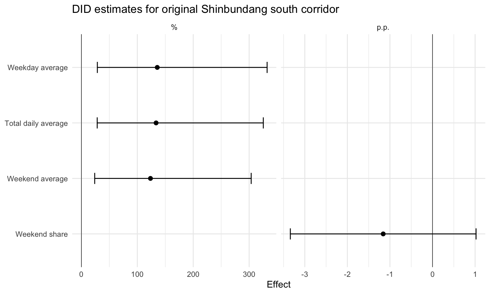
```

```{r fig-gyeonggi-dong, fig.cap='원 신분당선 corridor 개별 행정동 활동인구 DID 추정치'}
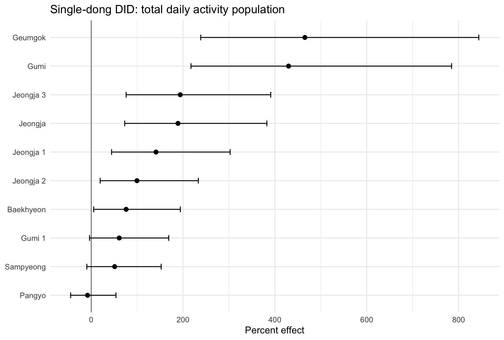
```
